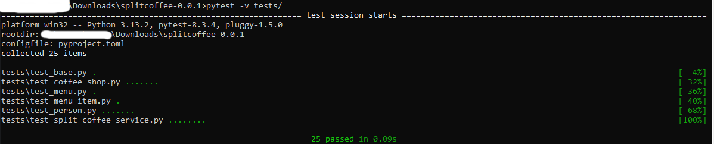
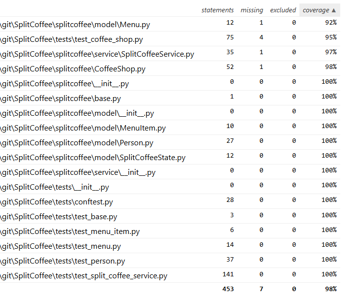

# SplitCoffee

A simple CLI app to determine who's turn it is to pay for coffee during lunch.

## Overview
The program will read in the people in the `people.json` file and the items available to order in the `menu_items.json`. 

Afterwards, it will execute group's first day getting coffee. It does this by performing the following steps:

1.  Get each person's order based on their favorite drink, or a random one based on their consistency_rate.
2. Assign a credit to everyone for their order.
3. Determine who pays by finding the person with the lowest amount of debt.
4. If there is a tie, attempt to break it by seeing if one person has paid more recently than another.
5. *Charge* the person for the sum total of the order. 

**See the [In-Depth Example](https://github.com/jguady/SplitCoffee?tab=readme-ov-file#in-depth-example) near the bottom for more detailed implementation notes**

## Assumptions  
### The following assumptions were made when creating the program  
 - The group decides that the fairest way to take turns paying based on an internal score.   
   - This score is made up of previous purchase history.
   - If there is a tie, then the person who hasn't paid in the longest time pays.
 - Items are only recorded in memory and not recalled in between runs.  
   - Since this is just a proof of concept and reduce complexity a database was not stood up.    
     - Either a SQL or No-SQL db would be appropriate for the data being managed by the application.   
 - People will always order something that is actually on the menu.   
   - If their favorite drink is on the menu they have a *chance* to order it see: [Person.py](https://github.com/jguady/SplitCoffee/blob/08c083fd646b6684eb441e10b049bbf29ff3fbfe/splitcoffee/model/Person.py#L30-L33)
 - Prices of menu items stay the same over time
   - The program could be enhanced to modify prices at runtime.
 - Each person only has 1 favorite
   - Jim only likes drip coffee since he likes his coffee "Black".
- Not everyone orders the same drink every day.
  - Exceptions to this are Bob and Jim:
    - Bob always orders a Cappuccino according to the requirements doc.
    - Jim always orders drip coffee (see previous assumption about "Black" coffee)
- No flavorings or additional costs modifiers are modeled. 
- No more than 365 people are currently going for coffee to be somewhat realistic and to limit for eventual overflows. 
	- This would likely cause an overwhelming rush in the coffee shop
	- This would likely be a massive expense to the company (in time waiting for coffees)
	- This would also cause huge fluctuations in peoples personal finances to whomever had to pay that day. 
	- More sophisticated tracking/datetime logic could be added in the future. 
- Only people who are present and give an order are considered for being charged.
	- It currently not possible to modify the set of people at runtime, but the program would support it if it were.  
- No Docstrings provided. This is a common python practice but will not be available until future releases. 
- The people and menu files are properly formatted and contain at least one element fitting the model when the program is run.


## Running the Program  

The program was created using **Python 3.13** and tested on **Windows 10**. Pycharm was used to develop the program. 

Windows can be a bit finnicky to get python programs to run, but ideally it should be as easy as
```shell
python .\splitcoffee\runner.py
```
However if this doesn't work then please try setting `PYTHONPATH=.` at the the root of the project (same as this [README.md](https://github.com/jguady/SplitCoffee/edit/main/README.md))

**Windows**
```shell
C:\...\splitcoffee-0.0.1> set PYTHONPATH=. 
```
**Linux**
```
$> export PYTHONPATH=.
```
If it is still not running take a look at the steps below to determine if the environment is setup correctly and feel free to reach out to me directly.

### Setup of the Environment

Again, if you see this error it is most likely for 2 reasons. 
1. You are not in the right directory (needs to be in root)
2. You did not set the `PYTHONPATH` correctly. 
```shell
Traceback (most recent call last):
  File "H:\...\SplitCoffee\splitcoffee\runner.py", line 4, in <module>
    from splitcoffee.cli import main
ModuleNotFoundError: No module named 'splitcoffee'
```
More recent editions of the python installation will allow you to use `python` or `py`, as an alias for `python3`, to run the program, however depending on your setup you may need to run `python3`. So you could also try 
```shell
python3 .\splitcoffee\runner.py
```
#### Python Virtual Environment (venv)
> [!Warning] 
> I'm less familiar with Python's venv but managed to get it working on Windows with the instructions below. I not test on linux but have provided instructions below that should work to set this up on linux.
> 
> Windows
> 
> ```
> python -m venv .venv
> .\.venv\Scripts\activate.bat
> ```
> 
> Linux
> 
> ```
> python3 -m venv .venv
> source .venv/bin/activate
> ```
>
> You can then pip install the required dependencies (and install pip beforehand if needed)
> 
> Windows
> 
> ```shell
> pip install -U pip setuptools wheel
> pip install -r requirements.txt
> ```
>
> Linux
> 
> ```
> pip install -U pip setuptools wheel
> pip install -r requirements.txt
> ```

## Interacting with the Program

There is a simple CLI that was made for the user to interact with.
### Program Arguments
Prior to running the program you can see the available options using program arguments

**Print help text**

`-h` , `--help`

**Turn on debug logging**

`-v`, `--verbose`


The program will immediately start executing the first order of the first day.
Once the first order is finished it will wait for the user to hit Enter to proceed. 

During this pause you can enter the following:

`q` - to exit the program

For an explination of the data you see each day and the way the program works see the [Overview](https://github.com/jguady/SplitCoffee/edit/main/README.md#overview)

---
## Manipulate Data  
  
### Changing the People  
You can modify the json file of people before running the program to add/remove people or adjust their parameters  
[people.json](splitcoffee/resources/people.json)

[people.json](https://github.com/jguady/SplitCoffee/blob/cd4814149518daaad4e6cec2f2c8e35b727de0aa/splitcoffee/resources/people.json#L1-L9)
  
### Changing the Menu  
The menu items json can also be adjusted to modify prices or add/remove drinks.  
[menu_items.json](splitcoffee/resources/menu_items.json)

[menu_items.json](https://github.com/jguady/SplitCoffee/blob/cd4814149518daaad4e6cec2f2c8e35b727de0aa/splitcoffee/resources/menu_items.json#L1-L7)

## Tests  
Under the tests folder are all the unit tests written for the program.

The `PYTHONPATH` also needs to be set here as well (see [above](https://github.com/jguady/SplitCoffee/blob/main/README.md#running-the-program))

If so the tests should be runnable with from the root project directory.
```shell
pytest tests/
```



There was a bug with Pycharm and Pytest including the test runners in the coverage files. Despite having a `.coveragerc` I was not able to exclude them completely.
Thankfully the coverage report has a filter function. Here is an image of the coverage of the source files based on the tests.



## Github Actions  

Under the `.github/workflows` directory there is a file [build.yml] which simply uses setuptools build a `whl` file and a `tar.gz` 

It then uploads the artifact to github.


## In-Depth Example

> [!Example]
> `Bob order=Cappuccino price=$3.75 debt=$0.00 total=$3.75`
> This line displays that Bob ordered a Cappuccino, it cost $3.75. Bob's current debt is $0.00 and he will be creddited $3.75 for his order, updating his debt to `($0.00 + $3.75)`
>
> At the end it will display a line for who is charged.
> 
> `Jay paid $20.50 for coffee today.`
>
> On the next day you'll see the line with Jay as
> 
> `Jay order=Mocha price=$4.10 debt=$-16.75 total=$-12.65`
>
> This shows that Jay ordered a Mocha costing `$4.10`, his debt is `$-16.75`. He will be creddited `$4.10` for his order, updating his debt to  `($-16.75 + $4.10) = $-12.65` 
