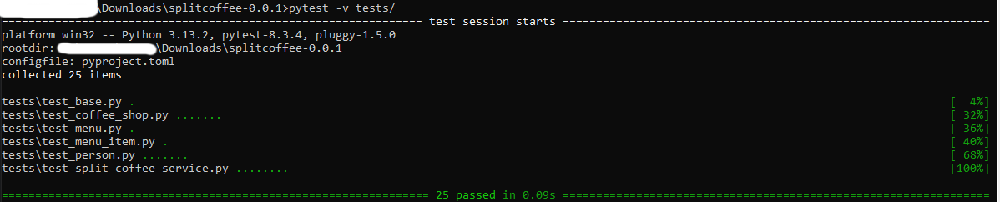
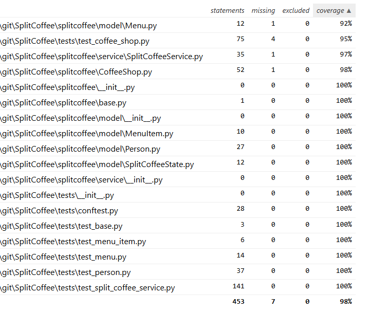

# SplitCoffee

A simple CLI app to determine who's turn it is to pay for coffee during lunch.

## Assumptions  
### The following assumptions were made when creating the program  
 - The group decides that the fairest way to take turns paying based on an internal score.   
   - This score is made up of previous purchase history.
   - If there is a tie then the person who paid hasn't paid in the longest time pays.
 - Items are only recorded in memory and not recalled in between runs.  
   - Since this is just a proof of concept and reduce complexity a database was not stood up.    
     - Either a SQL or No-SQL db would be appropriate for the data being managed by the application.   
 - People will always order something that is actually on the menu.   
   - If their favorite drink is on the menu they have a *chance* to order it see: [Person.py](splitcoffee/model/Person.py)  
 - Prices of menu items stay the same over time
   - The program could be enhanced to modify prices at runtime.
 - Each person only has 1 favorite
   - Jim only likes Drip coffee, not all non-dairy based drinks which could be considered "Black". 
- Not everyone orders the same drink every day
  - Exceptions to this are Bob and Jim:
    - Bob always orders a Cappuccino according to the requirements doc.
    - Jim always orders drip coffee (see previous assumption about "Black" coffee)
- No flavorings or additional costs modifiers are modeled. 
- No more than 365 people are currently going for coffee to be somewhat realistic and to limit for eventual overflows. 
	- This would likely cause an overwhelming rush in the coffee shop
	- This would likely be a massive expense to the company (in time waiting for coffees)
	- This would also cause huge fluctuations in peoples personal finances to whomever had to pay that day. 
	- More sophisticated tracking/datetime logic could be added in the future. 
- Only people who are present and give an order are considered for being charged.
- No Docstrings provided. This is a common python practice but will not be available until future releases. 
- The people and menu files are properly formatted and contain at least one element fitting the model.


## Running the Program  

The program was created and tested on windows. Pycharm was used to develop the program. 
Windows can be a bit finnicky to get python programs to run but ideally it should be as easy as:
```shell
python .\splitcoffee\runner.py
```
However if this doesn't work then please try setting `PYTHONPATH=.` at the the root of the project (same as this [README.md])
```shell
C:\...\splitcoffee-0.0.1> set PYTHONPATH=. 
```


## Interacting with the Program

There is a simple CLI that was made for the user to interact with. 
In general there are the following top level commands:

`help` - prints the available commands
`start` - starts the program, loading the people and menu items.
`q` - exits the program

**`start`**:
	Once the start command has been run. The program will continue to run and take orders each time the `ENTER` key is pressed. Each press of the enter key simulates a day of orders and then determines who to charge. It then charges that person and prompts the user if they would like to continue.

You can stop the simulation by typing `s` and hitting `enter`.

`q` here will also work but will exit the program entirely. 

  
## Manipulate Data  
  
### Changing the People  
You can modify the json file of people before running the program to add/remove people or adjust their parameters  
[people.json](splitcoffee/resources/people.json)  
[https://github.com/jguady/SplitCoffee/blob/db334948995624a5f57f4e2af5f5a5539ec87944/splitcoffee/resources/people.json  ](https://github.com/jguady/SplitCoffee/blob/cd4814149518daaad4e6cec2f2c8e35b727de0aa/splitcoffee/resources/people.json#L1-L9)
  
### Changing the Menu  
The menu items json can also be adjusted to modify prices or add/remove drinks.  
[menu_items.json](splitcoffee/resources/menu_items.json)  
[https://github.com/jguady/SplitCoffee/blob/db334948995624a5f57f4e2af5f5a5539ec87944/splitcoffee/resources/menu_items.json](https://github.com/jguady/SplitCoffee/blob/cd4814149518daaad4e6cec2f2c8e35b727de0aa/splitcoffee/resources/menu_items.json#L1-L7)

## Tests  
Under the tests folder are all the unit tests written for the program.

The `PYTHONPATH` also needs to be set here as well (see above)

If so the tests should be runnable with from the root project directory.
```shell
pytest tests/
```



There was a bug with Pycharm and Pytest including the test runners in the coverage files. Despite having a `.coveragerc` I was not able to exclude them completely.
Thankfully the coverage report has a filter function. Here is an image of the coverage of the source files based on the tests.



## Github Actions  

Under the `.github/workflows` directory there is a file [build.yml] which simply uses setuptools build a `whl` file and a `tar.gz` 

It them uploads the artifact to github.


